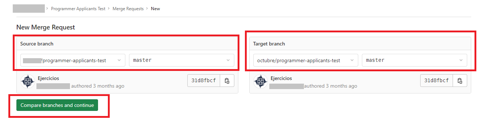
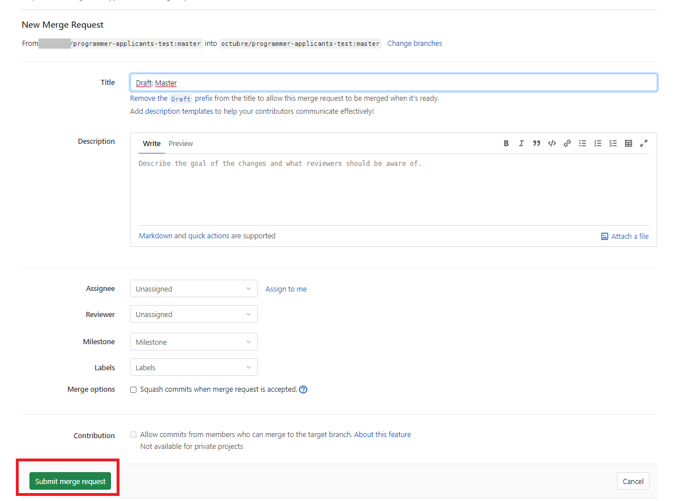

# Programmer Applicants Test

Examen para postulantes del puesto de programador

# Conocimientos necesarios

- git
- C#
- SQL

## Instrucciones

1. Hacer un fork de este proyecto

Ayudas:

https://docs.gitlab.com/ee/user/project/repository/forking_workflow.html#creating-a-fork

https://www.youtube.com/watch?v=Zab2WsNqy6A

2. Clonar localmente el proyecto forkeado

3. Resolver los ejercicios

- C# Basico (3 consignas en el archivo [`Ejercicios C#/Program.cs`](https://gitlab.com/octubre/programmer-applicants-test/-/blob/master/Ejercicios%20C%23/Program.cs))

- C# Herencia (12 consignas en el archivo [`Ejercicios Herencia/InheritanceExercise/Program.cs`](https://gitlab.com/octubre/programmer-applicants-test/-/blob/master/Ejercicios%20Herencia/InheritanceExercise/Program.cs))

- SQL Basico (10 consignas en el archivo [`Ejercicios SQL/Ejercicio SQL 2 - Con Inserts.sql`](https://gitlab.com/octubre/programmer-applicants-test/-/blob/master/Ejercicios%20SQL/Ejercicio%20SQL%202%20-%20Con%20Inserts.sql))

Ayudas:

Podes resolver este ejercicio usando la aplicación web https://sqliteonline.com/

4. Subir los cambios al proyecto forkeado

5. Compartinos el proyecto forkeado

Para compartirnos tu proyecto, Ir a **Merge Requests** > **New Merge Request** y seguí las indicaciones de estas capturas

Enviar

